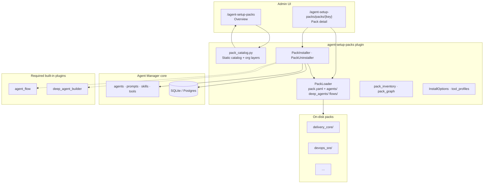
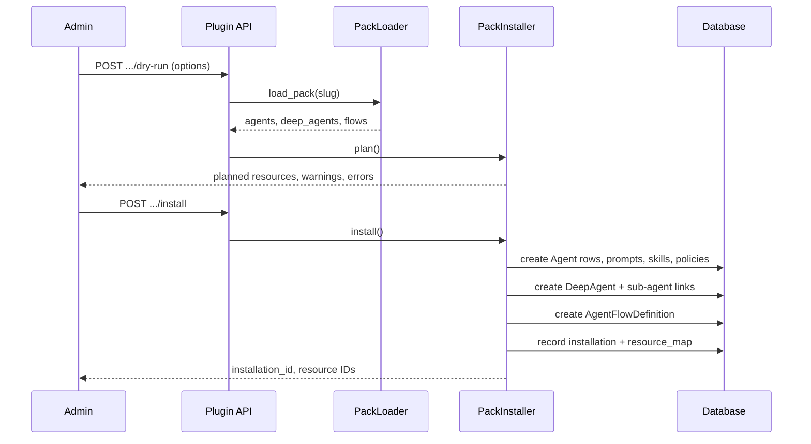
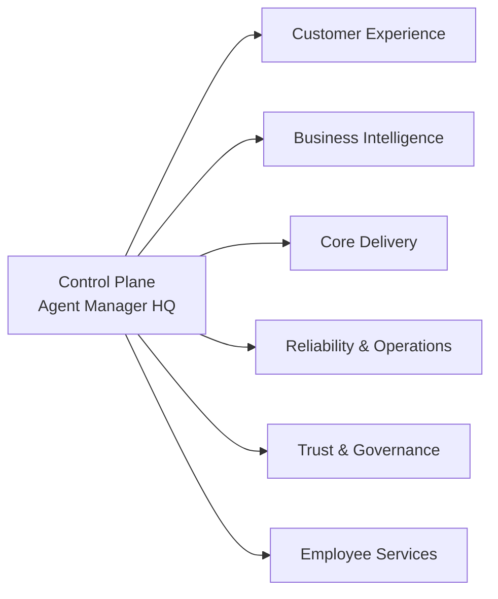

# Agent Setup Packs

**Versioned IT company agent templates for Agent Manager** — browse curated organizational packs, preview specialists and workflows, then install **Agents**, **DeepAgents**, and **AgentFlows** into your tenant with dry-run planning, alias control, and uninstall tracking.

| Catalog | On disk | Primitives |
|--------|---------|------------|
| **6** department packs | **42** agents · **6** deep agents · **18** flows | Agent · DeepAgent · AgentFlow |

---

## Overview

Modern IT organizations run many parallel functions: customer support, analytics, engineering delivery, platform operations, security governance, and internal service desk. Standing up consistent AI agents for each role is repetitive and error-prone.

**Agent Setup Packs** is a community plugin that ships ready-made, opinionated templates modeled after those functions. Each pack is a versioned folder on disk (`pack.yaml` + YAML/JSON definitions). The plugin exposes an admin UI under **Multi Agents → Setup Packs**, loads manifests from disk, and installs resources into core Agent Manager tables while recording provenance in plugin-owned tables.

Use it when you want a **fast, governed bootstrap** of multi-agent setups instead of hand-authoring dozens of prompts, skills, tool policies, and flow graphs.

---

## What you get

| Capability | Description |
|------------|-------------|
| **Pack catalog** | Six packs mapped to org layers (Customer Experience → Employee Services) with metaphors, audience, and resource counts. |
| **Ecosystem graph** | Interactive 3D force graph of packs, agents, deep agents, and flows (API + modal on overview page). |
| **Dry-run install** | Plan creates/skips/conflicts before writing anything. |
| **Full or partial install** | Install an entire pack or a single agent / deep agent / flow. |
| **Alias prefix** | Default `it_` prefix; flows rewrite `agent_alias` references to match. |
| **Tool profiles** | `prompt_only`, `read_only`, or `integrated` applied at install time. |
| **Uninstall** | Remove installed resources by pack or single logical key (with mapping cleanup). |
| **Install history** | `plugin_agent_setup_pack_installations` + resource map for audit and status UI. |

---

## Architecture



### Install sequence



---

## Organizational model

Packs are grouped by **org layer** — the same layers used on the overview page and in the ecosystem graph legend.



### Pack catalog

| Pack | Catalog key | Folder | Agents | Deep agents | Flows | Recommended |
|------|-------------|--------|--------|-------------|-------|-------------|
| Customer Technical Support | `customer_technical_support` | `customer_technical_support/` | 5 | 1 | 3 | |
| Data & Analytics | `data_analytics` | `data_analytics/` | 5 | 1 | 3 | |
| Engineering Delivery Core | `engineering_delivery_core` | `delivery_core/` | 7 | 1 | 3 | ✓ |
| DevOps & SRE Operations | `devops_sre_operations` | `devops_sre/` | 5 | 1 | 3 | ✓ |
| Security & Compliance | `security_compliance` | `security_compliance/` | 5 | 1 | 3 | |
| IT Service Desk | `it_service_desk` | `it_service_desk/` | 5 | 1 | 3 | |

Each pack includes role-specific **Agents** (specialists), one coordinating **DeepAgent** (team lead with `sub_agents`), and **AgentFlows** (DAG workflows with approval notes and optional cross-pack nodes).

---

## Primitives

| Primitive | Metaphor | Definition |
|-----------|----------|------------|
| **Agent** | Specialist | Focused role: prompts, skills, optional tools, tags. |
| **DeepAgent** | Team lead | Coordinates installed sub-agents within one department boundary (`is_deep`, async delegation). |
| **AgentFlow** | Assembly line | Repeatable workflow graph; nodes reference agents by alias; supports human approval gates. |

Alias convention: `{alias_prefix}_{alias_suffix}` (default prefix `it`, e.g. `it_product_requirements_analyst`). Flow JSON may declare `alias_prefix`; the installer rewrites node `agent_alias` values when you choose a different prefix.

---

## Requirements

| Requirement | Notes |
|-------------|--------|
| **Agent Manager** | Python ≥ 3.11, `uv sync`, database initialized (`uv run agent-manager-init`). |
| **External plugins path** | `PLUGINS_EXTERNAL_DIR` must include this folder (see [Setup](#setup)). |
| **`agent_flow` plugin** | Creates `AgentFlowDefinition` rows for pack flows. |
| **`deep_agent_builder` plugin** | Deep agents and `plugin_deep_agent_sub_agents` wiring. |
| **Optional integrations** | Jira, GitLab, browser, CLI tools, etc. — referenced in pack YAML; enable matching plugins and use the `integrated` tool profile when needed. |

Enable **agent_setup_packs** (and dependencies) from the admin **Plugins** page after discovery.

---

## Setup

From the Agent Manager project root:

```bash
uv sync
cp .env.example .env
```

In `.env`:

```env
PLUGINS_EXTERNAL_DIR=community_plugins
```

Start the application:

```bash
uv run agent-manager-init   # once per environment
uv run agent-manager
```

1. Open **Plugins** and enable **agent_flow**, **deep_agent_builder**, and **agent_setup_packs**.
2. Open **Multi Agents → Setup Packs** (`/agent-setup-packs`).
3. Pick a pack → review inventory → **Dry run** → **Install** (full pack or per resource).

---

## Using the UI

| Page | URL | Purpose |
|------|-----|---------|
| Overview | `/agent-setup-packs` | Layered catalog, install status, recent installations, ecosystem graph. |
| Pack detail | `/agent-setup-packs/packs/{catalog_key}` | Manifest, per-resource preview, install/uninstall actions. |

**Install options** (pack or single resource):

| Option | Default | Description |
|--------|---------|-------------|
| `alias_prefix` | `it` | Prefix for all created agent aliases. |
| `tool_profile` | `integrated` | `prompt_only` · `read_only` · `integrated` (see `services/tool_profiles.py`). |
| `flow_status` | `draft` | Initial flow status: `draft` · `active` · `archived`. |
| `visibility` | `creator` | `creator` · `all_admins`. |
| `on_alias_conflict` | `fail` | `fail` · `skip` · `suffix`. |
| `extra_tags` | `[]` | Additional tags applied at install. |
| `dry_run` | `false` | Plan only, no DB writes (install endpoint). |

After install, manage agents and flows from the standard **Agents** and **Agent Flow** admin screens. Installed resources remain linked via `plugin_agent_setup_pack_resource_map` for uninstall and status badges.

---

## HTTP API

All routes require an authenticated session unless noted. Base path: `/agent-setup-packs`.

| Method | Path | Description |
|--------|------|-------------|
| `GET` | `/api/ecosystem-graph` | Force-graph 3D payload + summary for all packs. |
| `GET` | `/api/packs/{pack_key}/manifest` | Pack manifest metadata and counts. |
| `GET` | `/api/packs/{pack_key}/inventory` | Full resource inventory from disk. |
| `GET` | `/api/packs/{pack_key}/preview/{type}/{logical_key}` | Preview agent / deep_agent / flow definition. |
| `POST` | `/api/packs/{pack_key}/dry-run` | Plan full pack install. |
| `POST` | `/api/packs/{pack_key}/install` | Install full pack. |
| `POST` | `/api/packs/{pack_key}/resources/{type}/{logical_key}/dry-run` | Plan single resource. |
| `POST` | `/api/packs/{pack_key}/resources/{type}/{logical_key}/install` | Install single resource. |
| `POST` | `/api/packs/{pack_key}/uninstall` | Uninstall all mapped resources for pack. |
| `POST` | `/api/packs/{pack_key}/resources/{type}/{logical_key}/uninstall` | Uninstall one resource. |

`resource_type`: `agent`, `deep_agent`, or `flow`. Request body for install endpoints: JSON matching `InstallPackPayload` in `router.py`.

---

## Repository layout

```text
agent-setup-packs/
├── plugin.py                 # PluginBase entry (meta, models, router, menu)
├── router.py                 # Pages + REST API
├── models.py                 # Installation + resource map tables
├── pack_catalog.py           # UI catalog (keys, layers, stats)
├── services/
│   ├── pack_loader.py        # Discover & load pack.yaml trees
│   ├── pack_installer.py     # Plan + install into core models
│   ├── pack_uninstaller.py   # Remove installed resources
│   ├── pack_inventory.py     # Inventory + previews
│   ├── pack_graph.py         # Ecosystem graph builder
│   ├── install_options.py    # InstallOptions + selection
│   └── tool_profiles.py      # Tool profile merging
├── templates/                # Jinja2 UI (extends core base.html)
├── docs/                     # Pack author notes (e.g. delivery_core)
└── <pack_slug>/              # One folder per pack
    ├── pack.yaml             # slug, catalog_key, version, name
    ├── agents/*.yaml
    ├── deep_agents/*.yaml
    └── flows/*.json
```

### Example: `pack.yaml`

```yaml
version: "0.1.0"
slug: delivery_core
catalog_key: engineering_delivery_core
name: Engineering Delivery Core
description: Agents and flows for software feature delivery.
```

### Example: agent template (abbreviated)

```yaml
version: "1"
logical_key: product_requirements_analyst
alias_suffix: product_requirements_analyst

agent:
  name: Product Requirements Analyst
  description: Turns rough requests into structured requirements.
  status: active

tags: [it-template, engineering, delivery-core]

prompts:
  AGENT_PROMPT: |
  ...

skills: [...]
tool_config: {...}
```

### Example: flow template (abbreviated)

```json
{
  "version": "1",
  "logical_key": "feature_intake_to_delivery_plan",
  "name": "Feature Intake To Delivery Plan",
  "alias_prefix": "it",
  "flow": {
    "start_node_id": "requirements",
    "nodes": [
      {
        "id": "requirements",
        "type": "agent",
        "agent_alias": "it_product_requirements_analyst"
      }
    ]
  },
  "optional_nodes": []
}
```

Flows may declare **`optional_nodes`** to insert resources from another pack when installed (e.g. security review gate in delivery flows).

---

## Authoring a new pack

1. Add a folder under `agent-setup-packs/` with `pack.yaml` (`slug` = folder name).
2. Add `agents/`, `deep_agents/`, and `flows/` definitions using existing packs as reference.
3. Register the pack in `pack_catalog.py` (`key`, `pack_slug`, org layer, stats, display lists).
4. Restart or reload the app; verify **on disk** badge on the overview page.
5. Run dry-run install and fix alias / sub-agent / flow reference errors before production install.

Internal notes for the reference implementation: `docs/delivery_core_notes.md`.

---

## Database tables

| Table | Purpose |
|-------|---------|
| `plugin_agent_setup_pack_installations` | One row per install run (status, options JSON, created IDs). |
| `plugin_agent_setup_pack_resource_map` | Maps `(installation_id, logical_key)` → core `resource_id` + alias. |

Tables are created when the plugin is enabled (`models()` + `create_all`).

---

## Development & tests

From project root:

```bash
uv run pytest tests/test_plugins/test_agent_setup_pack_installer.py \
  tests/test_plugins/test_pack_graph.py \
  tests/test_plugins/test_pack_inventory.py \
  tests/test_plugins/test_pack_install_status.py -q

uv run ruff check community_plugins/agent-setup-packs/
```

Tests use an in-memory SQLite database and import the plugin via `community_plugins/agent-setup-packs` on `sys.path`.

---

## Design principles

1. **Templates stay on disk** — Git-friendly, reviewable YAML/JSON; the database holds instances only.
2. **Catalog vs. slug** — `catalog_key` (API/UI) may differ from folder `slug` (e.g. `engineering_delivery_core` → `delivery_core/`).
3. **Human gates first** — Flows include `approval_notes`; agents document when to escalate; integrated tools expect policy constraints.
4. **Safe defaults** — Dry-run, alias conflict handling, and read-only tool profile for exploration.
5. **Composable org** — Optional cross-pack nodes let you grow from one department pack to a multi-pack ecosystem.

---

## Plugin metadata

| Field | Value |
|-------|--------|
| Plugin name | `agent_setup_packs` |
| Version | `0.1.0` |
| Menu | **Multi Agents → Setup Packs** |
| Route prefix | `/agent-setup-packs` |

---

## Related documentation

- [Community plugins guide](../README.md) — `PLUGINS_EXTERNAL_DIR`, plugin contract, troubleshooting.
- [Agent Manager AGENTS.md](../../AGENTS.md) — core vs. plugin boundaries, migrations, templates.
- [delivery_core author notes](docs/delivery_core_notes.md) — installer gaps, tool matrix, flow substitutions.

---

## License

Distributed as part of the Agent Manager community plugins collection. Follow the license terms of the parent Agent Manager repository when redistributing or modifying packs.
